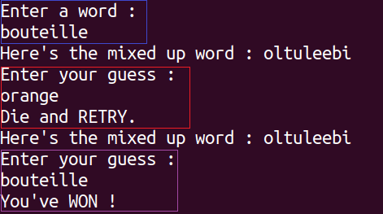

# Mystery Word in CPP
Ce projet est réalisé dans le cadre d'un cours OpenClassrooms.  
Le but étant de faire deviner à l'utilisateur un mot dont les lettres ont été mélangées aléatoirement _(pour le moment, un autre joueur doit entrer le mot mystère)_ en passant par le terminal.
## Déroulement du jeu
1. Le __Joueur1__ doit saisir un mot (cf carré bleu)
1. On affiche le mot mélangé au **Joueur2** afin qu'il devine le mot initial (cf carré rouge et violet)

Le jeu s'arrête quand le **Joueur2** à deviné le mot entré par le **Joueur1**. (cf carré violet)

## TODO
### Jeu  
- Un menu avant la partie
- Cacher le mot entré par le __Joueur1__
- Ajouter un mode un joueur

### Documentation
- Traduire le README en anglais
- Ajouter des captures des parties
- Ajouter un guide d'installation et de lancement

### Autres
- Ajouter un makefile

## Contributeurs
- [Agenor2512](https://github.com/Agenor2512/)
